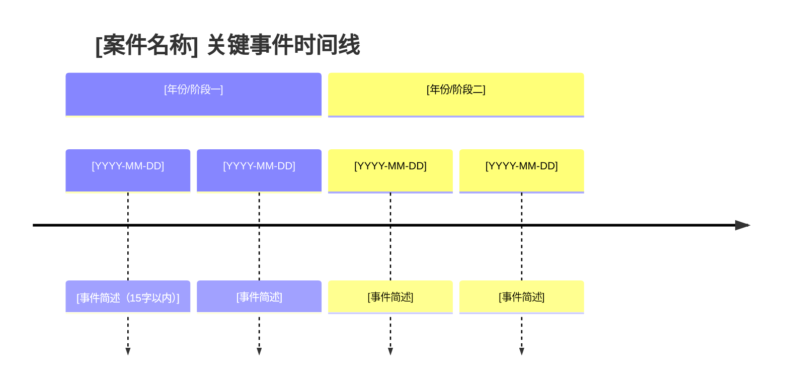
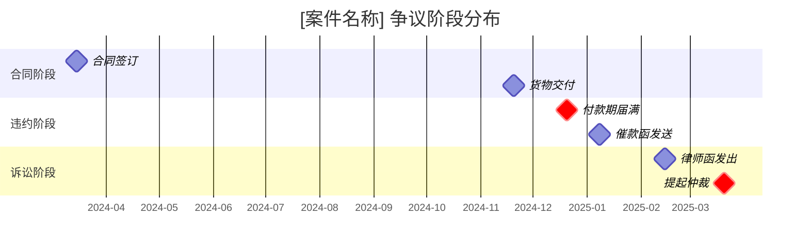

# /cn-chronology

1. 加载 `$LEGAL_AGENT_PROFILE_HOME/litigation-legal/matters/[slug]/matter.md` → 案件理论、关键转折事实、核心事实。
2. 加载 `$LEGAL_AGENT_PROFILE_HOME/litigation-legal/profile.md` → 文件存储来源、默认案件文件夹规则。
3. 遵循以下工作流程和参考规范。
4. 按顺序识别来源：本次会话用户提供的路径、默认案件文件夹、`CLAUDE.md` 中声明的来源。
5. 可读来源：提取有日期的事件。无法访问的来源：在"缺口"部分注明。
6. 去重，每条事件合并来源列表。
7. 按案件理论标注重要性（🔴/🟡/⚪）。
8. 写入 `$LEGAL_AGENT_PROFILE_HOME/litigation-legal/matters/[slug]/chronology.md`（或按标志写入格式变体）。
9. 如存在先前版本：版本号递增，向用户呈现差异摘要。
10. 完成前确认："时间线已构建完毕，请扫描🔴条目——有没有我判断有误的？"

---

# 中国案件时间线工具

## 证据材料使用限制

在处理一批诉讼文件前，先确认："这些文件中是否有通过法院调查令、对方举证或证据交换程序获取的材料？"若有：

- **民事诉讼：** 依《民事诉讼法》及相关司法解释，通过法定程序获取的对方证据，仅可用于本案诉讼目的，不得用于其他案件或商业目的。
- **行政诉讼：** 通过政府信息公开或行政复议程序获取的材料，使用目的须与申请目的一致。
- **刑事案件辩护材料：** 辩护律师依法查阅的卷宗材料受保密义务约束，不得在本案以外使用。

确认："本次使用在相关案件程序范围之内，或已取得对方同意，或相关文件已在庭审中公开。"未确认前标记："⚠️ 部分文件可能存在使用限制，请确认本次使用合规后再继续。"

## 目的

事实按时间发生。时间线是每份叙事的脊梁——起诉状的事实与理由、庭前准备、证人准备的核心素材。手工整理时间线耗时费力；AI 擅长结构化提取。关键在于：垃圾进，垃圾出。本工具从配置声明的来源以及用户上传的材料中提取。

## 模式

本工具服务于两种实践场景。从用户在插件配置 `CLAUDE.md` 中的 `## 角色` 选取默认值；用户可在每次运行时通过标志覆盖。

- **`--matter` 模式（企业法务默认）。** 以案件历史为中心。读取 `matter.md` 中的案件理论和核心事实，从声明的文件存储来源（企业OA、钉钉、飞书、本地服务器、iManage 等 `CLAUDE.md` 的 `## 系统环境` 部分声明的来源）拉取，将 `history.md` 作为内部运行日志（决策记录、律师意见、和解备忘录——刻意不纳入时间线）。输出以案件为中心：纠纷中发生了什么，按倡导性目的标注。
- **`--documents` 模式（律所律师/助理默认）。** 以证据材料为中心。读取配置中的案件理论，然后从证据目录、当事人文件集或有编号的材料中提取。输出以材料为中心：文件显示了什么，附证据编号，按案件理论标注。

两种模式最终收敛于相同的输出结构（时间线、🔴/🟡/⚪重要性标注、Mermaid图表、缺口、事实陈述版）。区别在于来源配置和重要性框架。

若 `## 角色` 为 `个人执业` 或 `其他`，默认 `--matter` 模式，但在首次运行时说明两种模式，由用户选择。

## 立场框架（重要性标注）

同一事件对于证明主张或反驳主张，其意义截然不同。读取业务规范文件（及案件层面覆盖默认值的立场）中的 `## 立场`：

- **原告/申请人（进攻性框架）** — 🔴 标注*确立*请求权要素（违约、侵权、损害、通知）、*填补*对方可能打开的漏洞、或*启动*有利于我方的诉讼时效的事件。🟡 标注支持主张但存在被质疑风险的事件。⚪ 是背景情境。
- **被告/被申请人（防御性框架）** — 🔴 标注*打破*请求权要素（因果关系、通知、信赖缺失）、*开启*诉讼时效或管辖权抗辩、或*支持*积极抗辩（免责、弃权、自甘风险、过失相抵）的事件。🟡 标注削弱对方叙事的事件。⚪ 是背景。
- **双方/不定** — 按每次时间线任务询问用户采用哪一方的框架进行重要性标注。底层时间线是中性的；只有重要性判读随立场变化。

在输出顶部注明所采用的框架：`重要性标注基于[原告/被告]立场。` 生成事实陈述版时，使用立场默认值，除非用户另有说明。

## 加载背景信息

通用：
- 插件配置 `CLAUDE.md` → 案件理论背景（企业法务：`## 系统环境` 含文件来源；律所律师：`## 案件理论` 和 `## 证据审查`，含平台和当事人信息）、`## 输出` 含工作成果标头。
- 本案件已有的 `chronology.md`（如存在）。
- 用户在本次会话中上传的文件或提供的路径。

`--matter` 模式还读取：
- `$LEGAL_AGENT_PROFILE_HOME/litigation-legal/matters/[slug]/matter.md` → 案件理论、核心事实、关键转折事实（用于重要性标注）、关键日期。
- `CLAUDE.md` 中的默认案件文件夹规则 → 该标识的文件存放位置。

`--documents` 模式还读取：
- 电子证据平台元数据（如有连接器可用：法大大、合同管家、电子证据保全平台等）——按当事人 + 日期范围。
- 证据目录清单或材料索引（如用户指向）。

**利益冲突审查门槛——不可绕过。** 审查证据前，检查 `$LEGAL_AGENT_PROFILE_HOME/litigation-legal/matters/_log.yaml` 中是否有该案件标识。如不在 `_log.yaml` 中，告知用户需要创建新的案件记录：

> "我在案件记录中未找到 [案件标识]。请先运行 `litigation-matter-intake` 以建立案件工作区。"

未经接案程序的案件，不得继续处理。`--documents` 模式（针对无案件标识的临时文件集运行）免于此门槛，但其输出应视为接案前研究材料，不得作为正式案件工作成果归档。

---

## 工作流程

### 第一步：识别文件来源

**`--matter` 模式：**

1. **用户提供的路径** — 本次会话中投入的任何内容（文件路径、网盘链接、邮件导出）。
2. **默认案件文件夹** — 来自 `CLAUDE.md` 的文件存储规则，按该标识展开（如 `D:/法律事务/案件/甲公司诉乙公司2025`）。
3. **声明的来源** — `CLAUDE.md` 中的 `文件存储` 表，过滤到本案件可能涉及的来源（如发件方通信的邮件存档、企业OA法务文件夹）。
4. **询问** — 若来源看起来薄弱，提示："我可以基于现有材料构建，但时间线会不完整。还有其他材料可以指向吗？关键邮件、合同、内部备忘录、律师函？"

**`--documents` 模式：**

1. **证据目录/材料集** — 用户指向证据目录或清单；工具按证据编号 + 日期读取。
2. **电子证据连接器** — 如有MCP连接器可用（法大大、合同管家、电子证据保全平台等），按当事人 + 日期范围拉取。
3. **当事人原始文件** — 如用户提供原始邮件箱或网盘导出，也一并读取。
4. **询问** — 若某关键当事人或日期段的覆盖看起来薄弱，提示。

### 第二步：拉取并读取

对于有可读文件的每个来源：

- **PDF、邮件（.eml）、.docx、.txt** — 直接读取。
- **邮件存档（企业邮箱、Gmail、Outlook）** — 如有MCP连接器已认证，按日期范围 + 对方/关键词查询；否则用户将相关会话导出至文件夹。
- **电子证据平台** — 如有连接器可用，按当事人 + 日期范围拉取；否则用户提供导出文件。
- **微信/钉钉聊天记录** — 仅读取用户提供的导出文件或截图（无直接平台连接器）；标注 `[截图来源——须核实原文]`。

若工具无法访问声明的某个来源，在输出的"缺口"部分明确列出，而非悄然继续。

**不得无声补充。** 若某个时间段的来源覆盖薄弱——可取文件少于该时间窗口的预期量、某当事人的邮件无法访问、某批材料尚未到位——如实报告发现内容并停止。不得从网络检索、公开记录检索或模型知识中填补空白。说明："来源返回了 [时间段/当事人] 的 [N] 条事件。覆盖似乎不足。可选方案：（1）指向额外来源（证据编号、文件夹、邮件箱）；（2）如已配置，尝试其他MCP连接器；（3）网络检索该时间窗口的公开记录事件——结果将标注 `[网络检索——须核实]`，使用前须与一手来源比对；（4）在此停止并记录缺口。请主办律师决定是否采用置信度较低的来源；本工具不代为决定。"

**来源归属标注。** 对每条时间线条目标注来源：文件路径、证据编号、MCP连接器或声明的文件存储来源（已记录在"来源"列）。对任何无法追溯至已取得文件的事件或日期——如来自模型训练数据的事实、网络检索到的公开记录事件——在行内标注：`[网络检索——须核实]`、`[模型知识——须核实]` 或 `[user provided]`（用户在会话中陈述的事实）。标注 `须核实` 的条目比文件来源条目的虚构风险更高，应优先核查。不得删除或合并来源标注——这是主办律师识别哪些条目需要在纳入文书前优先核实的最快信号。

**标注覆盖所有表述法律结论、期限或计算日期的部分——不仅限于时间线条目。** 时间线来源于文件。"缺口"部分、"核心事件"部分、理论关联描述，以及任何关于诉讼时效、时效中断、提交期限、举证期限或保密认定的表述，都是工具基于模型知识写出的法律分析，除非有来源支撑。每条此类表述均须携带溯源标注：`[依据：<引用规则及标注>计算]`、`[模型知识——须核实]`、`[user provided]`，或本次会话中检索到的来源标注。没有标注的诉讼时效窗口默认为 `[模型知识——须核实]`。

### 第三步：提取事件

对每份文件，识别有日期的事件：

- **邮件/微信/钉钉：** `[日期] [发送方] 告知 [接收方] [主题/内容]`
- **会议：** `[日期] [参会方] 就 [议题] 召开会议`（依会议记录或纪要）
- **决策：** `[日期] [决策方] 决定 [内容]`（依存档文件）
- **立案/诉讼文书：** `[日期] [当事方] 提交 [起诉状/答辩状/上诉状]`
- **外部事件：** `[日期] [事件发生]`（合同签署、产品交付、监管行动、事件达到法定标准）
- **行政行为：** `[日期] [行政机关] 作出 [行政许可/处罚/强制措施]`
- **工商/登记事项：** `[日期] [主体] 发生 [股权变更/法定代表人变更/注销]`

每份文件通常对应一个事件。偶尔为零（无日期或未确立事件）。有时为多个（涵盖数项决策的会议纪要）。

### 第四步：去重

同一事件出现在多份文件中：一次会议在三份日历上都有记录，还产生了一封纪要邮件——这是**一个事件有四个来源**，而不是四个事件。合并。合并后的条目引用所有来源。

### 第五步：标注重要性——依案件理论

从 `matter.md`（`--matter` 模式）或配置的 `## 案件理论` 部分（`--documents` 模式）读取关键转折事实和核心事实。对每条事件标注：

- 🔴 **关键** — 事件属于关键转折事实或对我方有利/不利的核心事实
- 🟡 **相关** — 情境信息、规律性证据、支撑次要论点
- ⚪ **背景** — 有助于完整性，不纳入文书

**纪律：** 300条条目全部标注🔴的时间线等于没有标注。将🔴保留给真正能影响事实认定者的事件。拿不准时，标🟡。

**边界判断：** 当某条目介于🔴和🟡（或🟡和⚪）之间时，标注较低重要性并行内加注 `[SME 核实——重要性边界判断]`。主办律师的判断优先于工具的判断。过度自信地高标注的时间线，不如一份坦承不确定性的时间线有用。

### 第六步：写入

默认输出为工作时间线，同时输出 Mermaid 图表。变体按需生成。

---

## 输出格式

### 工作时间线（默认）

位置：`$LEGAL_AGENT_PROFILE_HOME/litigation-legal/matters/[slug]/chronology.md`。完整、标注、带注释。主办律师使用的参考文件。

**每次输出均包含两部分：表格时间线 + Mermaid 图表。**

````markdown
[工作成果标头——依插件配置 ## 输出，按用户身份区分；参见 `## 用户身份`]

# 时间线 — [案件名称]

> 重要性标注（🔴/🟡/⚪）为初步判读，在用于任何外部工作成果（文书、事实陈述、董事会备忘录、对外律师交付物）前须经 `[SME 核实]`。

**案件标识:** [slug]
**模式:** matter | documents
**生成日期:** [YYYY-MM-DD]
**来源:** [N] 份文件，覆盖 [来源类型]
**条目数:** [N]（[N] 🔴 / [N] 🟡 / [N] ⚪）
**关键转折事实:** [一句话]
---

## 一、表格时间线

| 日期 | 事件 | 标记 | 来源 |
|---|---|---|---|---|
| [YYYY-MM-DD] | [发生了什么，一句话] | 🔴/🟡/⚪ | [文件路径或证据编号] |

---

## 二、Mermaid 可视化时间线

> 仅展示🔴和🟡条目，⚪背景条目省略以保持图表清晰。节点颜色：🔴红色、🟡黄色。



> 如事件密集或跨度较长，改用 `gantt` 图展示阶段分布：



---

## 三、核心事件（仅🔴）

[逐条列出，每条说明与案件理论的关联。]

### [日期] — [事件标题]
- **内容：** [一行说明]
- **理论关联：** [为何对案件理论重要]
- **来源：** [列表]

---

## 四、缺口

**无事件覆盖的时间段：**
[时间段——该期间文件在哪里？]

**预期存在但未见文件：**
[预期应有记录却未见的事件——如"2024年6月至2025年3月间的合同补充协议——未在证据中出现"]

**无法访问的来源：**
[在 CLAUDE.md 中声明但本次运行无法访问的来源——如"电子证据保全平台——无MCP连接器；需要导出文件"]

---

## 五、标记规范

- `[核实：具体事实主张——日期、参与方、内容]` — 尚未与底层文件核对
- `[存疑：法律定性——如某事件是否确立监管触发条件]`
- `[引用待定：证据编号/庭审笔录日期及页次]`
- `[SME 核实：重要性边界判断]` — 需要主办律师判断

---

## 六、版本记录
- v[N] 生成于 [日期]，来源概述：[来源摘要]
- v[N-1] 生成于 [日期]（先前版本，已被取代）
````

---

### Mermaid 图表生成规则

**图表类型选择：**

| 情形 | 推荐图表类型 |
|---|---|
| 事件总数 ≤ 15条，时间跨度 ≤ 2年 | `timeline`（最直观） |
| 事件总数 > 15条，或跨度 > 2年 | `gantt`（阶段分布更清晰） |
| 需要展示多方之间的因果/通知链 | `sequenceDiagram`（适合催款、通知类案件） |
| 存在多条并行争议线索 | `gantt` 多 section |

**Timeline 图表规范：**
- 每条节点文字不超过15个中文字
- 按自然时间顺序排列，不得跳跃
- section 按年份或争议阶段分组（合同阶段/履约阶段/违约阶段/诉讼阶段）
- 仅纳入🔴和🟡条目；⚪条目省略

**Gantt 图表规范：**
- 关键节点使用 `milestone`，持续阶段使用普通任务条
- 🔴条目加 `crit` 属性（红色高亮）
- section 按争议阶段命名
- `dateFormat YYYY-MM-DD`，`axisFormat %Y-%m`

**Sequence Diagram 规范（催款/通知链适用）：**
- 参与方限于3-5个（原告、被告、法院/仲裁机构、第三方）
- 每条消息描述不超过10个中文字
- 用 `Note` 标注关键法律节点（如"诉讼时效起算"）

**通用约束：**
- 日期格式统一为 `YYYY-MM-DD`
- 节点标题简洁，细节在表格和核心事件部分展开
- 不在图表中放置 `[核实]` 等标记，标记仅在表格和核心事件部分出现

---

### 事实陈述版（按需生成）

仅过滤🔴和相关🟡条目。以时间顺序叙事形式呈现——起诉状或仲裁申请书"事实与理由"部分的骨架。每段对应一个事件或紧密相关的事件群，附证据引用。

### 证人专项版（按需生成）

过滤指定证人为发件方、收件方、参会者或陈述对象的事件。为庭审前证人准备提供素材，帮助还原证人在特定时点的知情状态。

---

## 增量构建

若 `chronology.md` 已存在：

- 读取先前版本
- 从当前来源构建新时间线
- 差异对比：新事件（自上次构建以来）、修改条目（已有事件添加了新来源）、删除条目（罕见；注明原因）
- 保留先前版本号；以 `v[N+1]` 写入新版本
- 输出变更摘要

---

## 与 matter.md / history.md 的关系

**刻意分开**（企业法务 `--matter` 模式）。`history.md` 是主办律师的运行日志——决策记录、进展更新、程序里程碑、内部策略备注。`chronology.md` 是案件倡导性事实时间线。二者有重叠但不合并：

- 发出证据保全通知 → 进入 `history.md`（内部行动）。通常不进入时间线（不是争议本身的事实）。
- 对方于3月14日发送违约通知书 → 进入 `chronology.md`（🟡——确立其知情状态）。如接案时已提及，也进入 `history.md`。
- 内部和解方案备忘录草拟 → 仅进入 `history.md`。

若主办律师希望将 `history.md` 中的内容纳入时间线，可手动粘贴。默认分开存放。

---

## 本工具不做什么

- **解决矛盾。** 当两份文件对某事件的发生时间说法不一，两条条目均进入时间线并加标注。解决需由主办律师判断；可能需要证人询问或进一步取证。
- **凭空捏造来源中没有的事件。** 不在文件中（且不在 `matter.md` 或配置中作为已记录事实出现）的内容，不进入时间线——但"缺口"部分可能将其标记为预期缺失。
- **保证完整性。** 时间线的质量取决于来源的质量。若证据目录正在滚动提交且仅20%已到位，时间线如实反映这一现状。明确说明局限性。