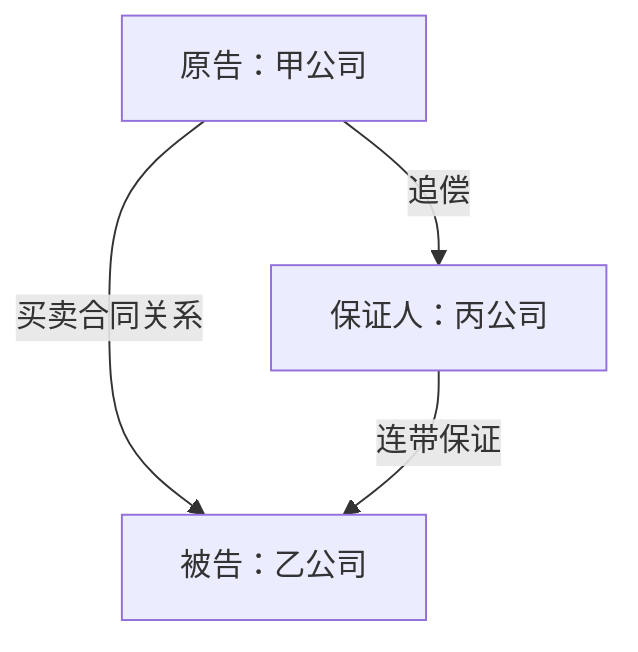
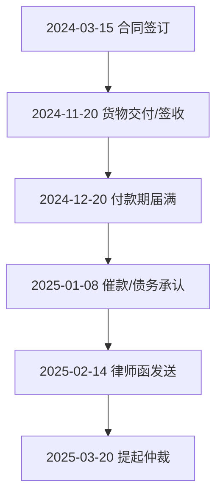
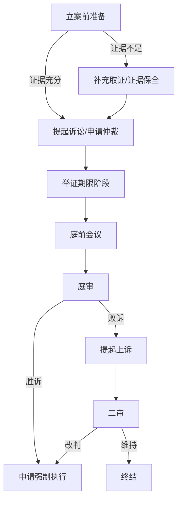

# /cn-claim-chart

1. 加载 `$LEGAL_AGENT_PROFILE_HOME/litigation-legal/profile.md` → 角色、工作成果标头、决策立场、文件存储。
2. 如已启用案件工作区，确认或选择当前案件；加载 `matter.md`（立场、管辖、阶段、理论、诉讼文书）。
3. 遵循以下工作流程和参考规范。
4. 模式选择：
   - `--patent` → 专利权利要求图表。须提供专利号和至少一项主张权利要求。子模式：`--infringement`（侵权）、`--invalidity-cnipa`（国知局无效宣告）、`--invalidity-court`（法院诉讼中的无效抗辩）、`--review`（审查）。
   - `--civil` → 民事要件图表。须提供请求权基础（或抗辩事由）和当事方立场。可加 `--arbitration` 标志切换为仲裁程序框架。
   - 无标志 → 询问用户选择哪种。
5. 民事模式：参考本 skill 目录下 `references/element-templates-cn.md` 中的基准要件列表。在对应前与用户确认适用的裁判规则或法律条款。
6. 专利模式：将主张权利要求解析为要素，标注有争议的术语以待权利要求解释，适用已有的权利要求解释意见。
7. 将要素对应至目标（被控侵权产品/现有技术/证据材料/待审图表）。每格均附引用出处。写入任何以 `=`、`+`、`-`、`@`、制表符或回车开头的单元格值前，先加前缀撇号进行中和处理。
8. 生成缺口清单（民事模式）或待补证据清单（专利模式）——这是优先输出。
9. **新增：** 在要件图表完成后，依次输出：法律关系图（Mermaid）、案件发展流程图（Mermaid）、争议焦点分析、双方诉讼策略表格、诉讼程序图（Mermaid）。
10. 写入 Markdown、CSV（值文件 + `_sources` 伴随文件）以及 Excel 或 Sheets（按用户偏好）。每份输出均附工作成果标头。
11. 如案件处于活跃状态，写入案件的 `claim-charts/` 文件夹；否则写入实践层级的 `claim-charts/` 文件夹。如案件处于活跃状态，在 `history.md` 中追加一行记录。
12. 返回摘要读出：权利要求/诉请、目标、管辖、阶段、按状态统计的要素数量、缺口清单、文件路径，以及"每格都是线索"的提示。

---

# 中国法律要素对应图表工具

## 证据材料使用限制

在处理一批诉讼文件前，先确认："这些文件中是否有通过法院调查令、对方举证或证据交换程序获取的材料？"若有：

- **民事诉讼：** 依《民事诉讼法》第68条及《最高人民法院关于民事诉讼证据的若干规定》，通过法定程序获取的证据材料，仅可用于本案诉讼目的，不得用于其他案件或商业目的。
- **行政诉讼：** 通过政府信息公开或行政复议程序获取的材料，使用目的须与申请目的一致。
- **刑事案件辩护材料：** 辩护律师依法查阅的卷宗材料受《律师法》第38条保密义务约束，不得在本案以外使用。
- **仲裁程序：** 依各仲裁机构规则（CIETAC、上仲等），通过仲裁程序取得的证据材料通常负有保密义务，使用范围须符合仲裁协议约定。

未确认前标记："⚠️ 部分文件可能存在使用限制，请确认本次使用合规后再继续。"

## 图表是草稿，不是认定，也不是正式主张

**在每份输出的顶部加上以下内容。不得省略，不得软化。**

> 本图表是供律师分析和核实的草稿，不是已提交的侵权/无效主张，不是法律意见书，不是庭审陈述，也不是判决申请依据。每一处对应关系都是律师须对照原始材料核实的线索。所列要件来自裁判规则、司法解释或权利要求语言的解析——用户所在法院/仲裁机构的**控制性**规则（最高院司法解释、具体法院的审判标准、国知局审查指南、仲裁规则）可能有所不同，且始终优先适用。缺口检测是启动取证或提出主张的起点，不是关于案件是非曲直的结论。

低估缺口是单向门——缺乏要件支撑的起诉状可能被驳回、缺乏证据的诉讼请求可能败诉、未经证明的损害可能得不到支持。高估缺口是双向门——律师在审查中消除标注。默认偏向双向门。

---

## 案件背景

检查实践层级 `CLAUDE.md` 中的 `## 案件工作区`。如 `已启用` 为 `✗`（企业法务用户默认值），跳过本段——各技能使用实践层级背景，案件工作机制不可见。如已启用且无活跃案件，询问："这是哪个案件？运行 `litigation-matter-workspace switch <标识>` 或说 `实践层级`。"加载活跃案件的 `matter.md`——尤其是案件理论、诉讼文书/起诉状（用于实际主张的要件）、管辖法院、已有的权利要求解释意见或约定解释（专利模式），以及案件阶段。将输出写入案件文件夹 `$LEGAL_AGENT_PROFILE_HOME/litigation-legal/matters/<案件标识>/claim-charts/`。除非 `跨案件背景` 为 `开启`，否则不得读取其他案件的文件。

---

## 加载背景信息

- `$LEGAL_AGENT_PROFILE_HOME/litigation-legal/profile.md` → 角色、工作成果标头、决策立场、文件存储、案件理论框架
- 活跃案件的 `matter.md` — 请求权、抗辩、立场、管辖、阶段、理论
- 民事模式：起诉状或反诉状（用于实际主张的诉请）、答辩状（用于实际主张的抗辩事由）、相关裁判规则来源，以及证据材料（庭审笔录、陈述书、已提交文件、专家报告）
- 专利模式：专利文本、主张权利要求、说明书、申请历史（如可获取）、被控侵权产品材料或现有技术文献、已有权利要求解释意见或约定解释

如 `CLAUDE.md` 含 `[PLACEHOLDER]` 标记，显示以下提示：

> 我注意到您尚未配置实践档案——这是我将风险校准、系统环境和本所风格定制到您具体实践的方式。
>
> **两个选择：**
> - 运行 `litigation-cold-start-interview`（约2分钟）配置档案，然后我将针对您的实践定制运行。
> - 说**"临时模式"**，我将使用通用默认值运行——中国大陆管辖、中等风险偏好、律师角色、无实践手册——并将每份输出标注为 `[临时模式——配置档案以获取定制输出]`，以便您在确认前查看效果。

### 临时模式

用户说"临时模式"时，使用以下通用默认值正常构建图表：中等风险偏好、律师角色、中国大陆管辖、无实践层级手册（依案件诉讼文书和实际主张的要件）。在审稿说明和图表每行标注 `[临时模式]`。输出末尾追加：

> "本次运行使用通用假设默认值。运行 `litigation-cold-start-interview` 获取针对您的实践定制的输出——您的风险校准、您的系统环境、您的本所风格。约2分钟。"

**利益冲突审查门槛——不可绕过。** 构建图表前，检查 `$LEGAL_AGENT_PROFILE_HOME/litigation-legal/matters/_log.yaml` 中是否有该案件标识。如不在 `_log.yaml` 中，告知用户需要创建新的案件记录：

> "我在案件记录中未找到 [案件标识]。请先运行 `litigation-matter-intake` 以完成接案程序"

未经接案程序的案件，不得继续处理。

---

## 模式选择

在开始任何工作之前先询问：

> 需要哪种图表？
>
> 1. **专利权利要求图表** — 将权利要求限定特征逐一对应被控侵权产品（`--infringement`）、现有技术（`--invalidity-cnipa` 或 `--invalidity-court`）或他方图表（`--review`）。适用于侵权主张、国知局无效宣告请求/意见、FTO 图表。
> 2. **民事要件图表** — 将请求权基础（或抗辩事由）的构成要件对应证据材料。适用于起诉状合规性检查、取证规划、诉讼策略准备、证明顺序提纲。可加 `--arbitration` 标志切换仲裁程序框架。

两种模式共同的基本信息收集：

- **立场。** 主张方还是应对方？（民事模式中影响举证责任；专利模式中影响侵权/无效框架。）
- **管辖/论坛。** 省份和法院——裁判规则因地而异（最高院司法解释、各高院审判指引、具体法院惯例）。专利模式中，国知局无效程序与法院侵权诉讼并行，规则不同。标注哪个控制。
- **阶段。** 起诉前、立案、答辩期、举证期限、庭前会议、庭审、一审判决、上诉、再审。图表相同；输出的框架不同。
- **已有图表？** 如为 `--review`，加载该图表。

---

# 模式一：专利权利要求图表

## 子模式

- `--infringement` — 权利要求特征 vs. 被控侵权产品（侵权主张证据准备、起诉状附件、庭审证据）
- `--invalidity-cnipa` — 权利要求特征 vs. 现有技术（国知局无效宣告请求证据准备）
- `--invalidity-court` — 权利要求特征 vs. 现有技术（法院诉讼中的无效抗辩）
- `--review` — 审查他方已制作的图表

**重要提示：中国专利无效走行政程序（国知局复审和无效审理部），不同于法院侵权诉讼中的无效抗辩。两条路径的举证标准、程序规则和救济方式均有实质差异，须在子模式选择时确认。**

## 专利模式额外信息收集

- **专利号和主张权利要求。** 哪些独立权利要求，哪些从属权利要求。（除非要求，否则不对未主张的权利要求制图。）
- **优先权日期。** 确定《专利法》第22条新颖性判断的基准日，以及申请日前公开的现有技术范围。
- **已有解释意见。** 法院已作出的权利要求解释（如有）、约定解释、国知局审查意见中的解释。
- **专利类型。** 发明专利（保护期20年）、实用新型（10年）、外观设计（15年）。不同类型的保护范围规则有差异。

## 专利模式工作流程

### 第一步：解析权利要求

将主张的独立权利要求解析为编号特征。处理：

- **前序部分。** 注意是否构成限定——权利要求解释问题。标注 `前序限定性：待确定`，除非已有解释意见解决。
- **过渡词。** "包括"/"包含"（开放式）/ "其特征在于"（半开放式）/ "由……组成"（封闭式）。影响附加未记载特征是否构成侵权。
- **特征** 按逗号/分号分隔，编号为 `[1a]`、`[1b]`、`[1c]`。保持编号稳定——这是图表的骨架。
- **功能性限定** — "用于……的装置/部件"或非结构性功能术语。保护范围为说明书中记载的对应结构及其等同物。按说明书页/段引用对应结构。如说明书未记载对应结构，标注 `说明书公开不足`。
- **从属权利要求** — 引用母权利要求；仅对附加限定特征制图。**执行，不要笼统带过。**
- **结构性术语同义词——默认为`解释依赖`。**

  | 领域 | 同义词族（标注为`结构术语同义词`） |
  |---|---|
  | 紧固件/锚固件 | 倒钩/螺纹/凸起/凸棱/翼片/齿 |
  | 流体/导管 | 管腔/通道/孔径/通路/导管 |
  | 机械壳体 | 轮毂/凸台/法兰/套环/肩部 |
  | 紧固件/接头 | 插座/凹槽/口袋/空腔 |
  | 电气/电子 | 触点/端子/焊盘/引线 |
  | 光学 | 透镜/反射镜/窗口/孔径 |
  | 结构性 | 壁/构件/支撑/支柱/肋 |
  | 表面 | 表面/面/界面 |

向用户展示解析结果。确认后再进行对应。解析错误会污染以下每一行。

### 第二步：权利要求解释核查

标注有争议的术语：说明书中创造或定义的术语、有申请历史的术语（修改/意见陈述/放弃——影响禁止反悔原则）、功能性语言、相对性术语（"基本上"/"约"——《专利法》第26条第4款不清楚风险）、计算机实施术语（国知局无效程序中的技术方案不明确风险）。

对每个标注的术语，说明在哪种解释下对应成立、在哪种解释下不成立。

### 第三步：对应

对每项特征、每个目标，定性对应关系：

| 对应类型 | 含义 | 适用模式 |
|---|---|---|
| `字面对应` | 权利要求语言落入被控特征/现有技术公开 | 两种 |
| `字面对应-解释依赖` | 在X解释下字面对应，在Y解释下不成立 | 两种 |
| `等同侵权` | 功能-方式-结果或非实质性差异 | 仅侵权 |
| `预期` | 单一文献中每项特征均已公开 | 仅无效 |
| `显而易见-组合` | 辅助文献补充缺失特征；须有结合动机 | 仅无效 |
| `部分` | 部分特征存在 | 两种 |
| `未发现` | 特征不存在 | 两种 |
| `待补证据` | 从现有材料无法判断 | 两种 |
| `解释依赖` | 取决于有争议术语如何解释 | 两种 |

**不得无声补充。** 文件薄弱意味着 `待补证据`，不得依据类似产品推断。

### 第四步：从属权利要求与等同侵权补充分析——执行，不要笼统带过

对每项主张的从属权利要求，实际生成对附加限定特征的对应行。对每项字面对应但结构上相似而非字面相同的特征，生成配对的等同侵权候选行，包含功能-方式-结果概述、禁止反悔风险、公开献给公众风险标注。

### 第五步：间接侵权、共同侵权（仅侵权模式）

标注，不作法律认定：帮助侵权（《专利法》第70条）、引诱侵权（《专利法》第70条）、共同侵权（《民法典》第1168条）、惩罚性赔偿（《专利法》第71条第2款，最高5倍）。

### 第六步：无效判断标准

**国知局无效宣告（`--invalidity-cnipa`）：** 新颖性（《专利法》第22条第2款）、创造性（第22条第3款，须标注区别技术特征带来的技术效果）、不清楚（第26条第4款）、说明书公开不足（第26条第3款）、主题不可专利（第25条）。

**法院诉讼中的无效抗辩（`--invalidity-court`）：** 法院通常中止侵权诉讼等待国知局结论；须同时考虑两条路径的程序策略选择；无效须达到优势证据标准。

### 第七步（审查子模式）：审计

对每行输出判断结论（`支持` / `薄弱` / `不支持`）和图表薄弱环节。

---

# 模式二：民事要件图表

## 工作流程

### 第一步：确定请求权

确认请求权基础或抗辩事由、当事方立场、管辖法院、实际主张的诉讼文书。

### 第二步：加载要件

三条路径：(a) 模板库（`references/element-templates-cn.md`）；(b) 用户自定义；(c) 抗辩事由。

**管辖特定表述——主动呈现，无需询问：**

| 请求权/抗辩 | 基准 | 管辖特定表述 |
|---|---|---|
| 合同违约 | 四要件（《民法典》第577条）| 买卖合同另适用合同编分则；建设工程合同适用《最高院建设工程合同司法解释》 |
| 货物买卖合同 | 合同法通用违约要件 | 涉外买卖须确认是否适用CISG |
| 侵权损害赔偿 | 四要件（《民法典》第1165条）| 高度危险责任（第1236条）/产品责任（第1202条）适用无过错责任 |
| 股东知情权 | 三要件（《公司法》第57条）| 新《公司法》（2024年7月施行）扩大查阅范围，须区分新旧法时间节点 |
| 股东代表诉讼 | 四要件（《公司法》第189条）| 新《公司法》对前置程序有修改 |
| 劳动合同违法解除 | 三要件（《劳动合同法》第48条）| 赔偿金计算基数各地不同（上海/北京/广东各有规定）|
| 不当得利 | 四要件（《民法典》第985条）| 注意与缔约过失责任（第500条）的竞合处理 |
| 诉讼时效抗辩 | 三年（《民法典》第188条）、中断/中止（第194-195条）| 知识产权各自时效起算点不同 |

### 第三步：对应

对每项要件，提供支持证据（附出处）、反驳证据、强度（`强`/`中`/`弱`/`无`）、状态（`已支撑`/`部分`/`争议中`/`缺口`/`待补证据`）。逐字引用书证和证词，不得释义。

**举证期限提示：**
> ⚠️ 以下要件缺乏证据支撑，请在举证期限（[日期]，如已知）届满前补充。逾期提交的证据可能被法院不予采纳（《最高人民法院关于民事诉讼证据的若干规定》第53条）。

### 第四步：缺口检测——核心输出

> **证据薄弱或缺失的要件：**
> - 主张方：影响起诉状成立、诉讼请求支撑或庭审证明，举证期限届满前补充。
> - 应对方：原告须证明每项要件，缺口即为抗辩机会。
> - 立案前/证据收集阶段：通过申请法院调查令、证据保全、专家鉴定将缺口转化为`已支撑`或确认为`无`。

### 第五步：阶段性框架

立案前/起诉状审查（《民事诉讼法》第122条）→ 举证阶段（注明举证期限）→ 庭前准备 → 庭审（证明顺序）→ 仲裁模式（`--arbitration`，替换为仲裁机构规则框架）。

### 第六步（审查子模式）：审计

针对对方文书，逐要件审查证据是否真正支撑主张，识别图表薄弱环节。

---

# 新增模块：案件综合分析

**以下四个模块在要件图表完成后依次输出，仅适用于民事模式（`--civil`）。专利模式跳过本节，直接进入"共用框架"。**

---

## 模块一：法律关系图与案件发展流程图

### 1. 主体关系图

从案情摘要、相关材料、案件时间线中梳理各主体之间的法律关系，以 Mermaid 语言输出。

**生成规则：**
- 节点为案件各主体（当事人、第三人、监管机构等）
- 连线标注双方之间的法律关系类型（合同关系、股权关系、担保关系、侵权关系等）
- 采用从上至下排布（TD）
- 仅呈现与案件直接相关的主体和关系，不引入与争议无关的背景主体



### 2. 案件发展流程图

梳理案件事实发生的时间顺序，以 Mermaid 语言输出关键节点。

**生成规则：**
- 节点为案件中的关键事实节点（合同签订、货物交付、付款期届满、催款、律师函、起诉等）
- 采用从上至下排布（TD）
- 仅列入有证据支撑或案情摘要中已记载的事实，不推断未记载事件
- `[核实：...]` 标记用于来源不明或需要核实的节点



**标注规范：**
- 每个节点文字不超过20个中文字
- `[核实：...]` 标记用于来源不明或需核实的节点，不得在图中伪造事实
- 不得将推断事件作为节点纳入图表

---

## 模块二：争议焦点分析

### 生成规则

依据案情摘要、相关材料、要件图表的缺口清单，提炼本案核心争议焦点。

**提炼要求：**
- 如案情摘要或材料中已明确指出争议焦点，直接采用，不额外生成
- 争议焦点数量控制在5个以内，对相关争议点整合归纳
- 每个焦点须具体且关键，避免抽象泛化

**分析要求（对每个争议焦点）：**

对每个争议焦点，从以下四个维度展开分析，但表述须灵活，不在段落开头机械重复维度标题：

一是法律规则的适用性——准确援引相关法条（格式：《XXX法》第XX条规定，XXXX），说明是否直接适用于本案情形；若存在法律解释分歧、新旧法冲突或适用条件不完全满足，明确指出。

二是支持与反对观点的双面论证——既说明有利于主张方的法律与事实依据，也分析对方可能提出的有效抗辩；避免仅呈现单方逻辑链。

三是事实与证据的制约因素——明确哪些结论依赖于特定事实的成立；若关键事实缺乏充分证据支撑，说明其对裁判结果的影响。

四是裁判结果的不确定性与风险提示——说明可能的裁判结果范围（全部支持/部分支持/驳回），明确不确定性来源（法律适用存疑/证据不足/司法实践不统一）。

**引用规范：**
- 引用法条：《XXX法》第XX条规定，XXXX
- 引用案例：用【】括注案号或案件名称，如【（20XX）青074民初19号】，并以一两句话概括其对当前焦点的论证价值
- 禁止编造法条编号、案号或案件名称；禁止引用与当前争议焦点无关的内容
- 仅引用相关材料和已知案例中存在的法条和案例，不自行捏造

**输出格式：**
- 争议焦点编号从1开始，编号与问题一行显示
- 分析内容在焦点问题下方展开，换行分段，不使用数字分点
- 结尾不得输出总结、说明、注意等无关内容

**示例格式：**

1.乙公司在付款期届满后未付款，是否构成合同违约？

《中华人民共和国民法典》第577条规定，当事人一方不履行合同义务或者履行合同义务不符合约定的，应当承担继续履行、采取补救措施或者赔偿损失等违约责任。本案中，合同明确约定货到30日内付款，付款期已届满……

但乙公司可能抗辩货物存在质量瑕疵，主张行使同时履行抗辩权（《民法典》第525条）……

关键事实在于签收单是否记载质量异议，以及乙公司是否在合理期限内提出书面异议。若无异议记录，法院倾向于认定乙公司已认可货物质量……

---

## 模块三：双方诉讼策略

### 生成规则

基于要件图表的缺口清单、争议焦点分析、证据清单，分别站在我方（诉求主张人）和对方当事人的立场，梳理每个诉讼阶段的具体策略。

**诉讼阶段确定规则：**
- 根据案情进展、争议内容、证据完备程度、是否已提起诉讼、案件类型，合理推断当前及后续必要阶段
- **仅列出当前尚未发生且实际可能发生的阶段**——如案件明显未起诉，无需出现二审阶段；如案件已有一审判决，不再分析一审阶段
- 仲裁模式（`--arbitration`）替换为：申请仲裁前 → 提交仲裁申请书 → 答辩期 → 证据交换 → 开庭审理 → 裁决

**输出格式：**

以 Markdown 表格形式输出，分"我方诉讼策略"和"对方诉讼策略"两张表格，两张表格之间空一行。对方诉讼阶段须与我方完全对应。

- 我方诉讼策略 = 该阶段主张方（原告/申请人）应采取的具体行动
- 对方诉讼策略 = 直接针对我方策略设计的反制、阻断或削弱措施
- 每格内容以 `1.` `2.` 分点列出
- 引用案例时用【】括注案号，并以一两句话说明其对策略的论证价值
- 禁止编造案号；禁止引用与当前策略无关的案例

**标题及格式要求：**
- 标题"**（一）具体诉讼策略**"加粗输出，不得遗漏
- 两张表格前分别输出"我方诉讼策略："和"对方诉讼策略："
- 禁止输出除标题和表格之外的其他解释内容

**表格结构：**

我方诉讼策略：
| 诉讼阶段 | 我方诉讼策略 | 关键要点 | 风险提示 |
|---|---|---|---|
| 举证期限阶段 | 1. ...<br>2. ... | 1. ...<br>2. ... | 1. ...<br>2. ... |

对方诉讼策略：
| 诉讼阶段 | 对方诉讼策略 | 关键要点 | 风险提示 |
|---|---|---|---|
| 举证期限阶段 | 1. ...<br>2. ... | 1. ...<br>2. ... | 1. ...<br>2. ... |

**各列说明：**
- **我方诉讼策略列：** 结合案情、争议焦点和证据清单，提出该阶段应采取的具体行动
- **关键要点列：** 该阶段需特别注意的操作细节
- **风险提示列：** 基于现有证据缺口、对方可能的抗辩及争议焦点的不确定性，指出若不采取有效措施可能导致的不利后果
- **对方诉讼策略列：** 直接针对我方该阶段策略的反制措施（如我方"申请财产保全"，对方策略应为"提供担保申请解除保全"或"质疑保全必要性"）
- **对方关键要点列：** 对方若想有效对抗，必须把握的核心操作或事实主张
- **对方风险提示列：** 对方实施对抗策略时自身可能存在的漏洞、举证困难或法律短板

---

## 模块四：诉讼程序图

### 生成规则

根据诉讼策略中确定的每一阶段，以 Mermaid 流程图展示每一阶段我方的预期结果及走向。

**生成要求：**
- 标题"**（二）诉讼程序**"加粗输出，不得遗漏
- 采用从上至下排布（TD）
- 节点为每个诉讼阶段及其可能结果（胜/败/和解/上诉等）
- 不出现"起点""终点"等与诉讼程序无关的表述
- 禁止输出除标题和流程图之外的其他解释内容

**示例格式：**

**（二）诉讼程序**



---

# 共用框架（两种模式）

## 输出顺序

民事模式的完整输出顺序：

1. **要件图表**（Markdown 表格）
2. **缺口清单**（优先输出）
3. **模块一：法律关系图 + 案件发展流程图**（Mermaid）
4. **模块二：争议焦点分析**
5. **模块三：双方诉讼策略表格**
6. **模块四：诉讼程序图**（Mermaid）
7. **CSV 和电子表格文件**
8. **摘要读出**

专利模式的完整输出顺序：

1. **权利要求图表**（Markdown 表格）
2. **待补证据清单**（优先输出）
3. **CSV 和电子表格文件**
4. **摘要读出**

## Markdown 表格（始终输出）

**专利模式示例：**

```markdown
| [#] | 特征（原文） | 被控特征 | 证据（附出处） | 对应类型 | 状态 | 已核实 |
|---|---|---|---|---|---|---|
| 1a | "配置为……的处理器" | 芯片组（见技术规格书）| [规格书第7页]"……" | 字面对应-解释依赖 | 已对应 | ☐ |
| 1b | "用于[功能]的装置"（功能性限定）| [主张的等同物] | [source, file.c:124]"……" | 待补证据 | 待补证据 | ☐ |
```

**民事模式示例：**

```markdown
| [#] | 要件 | 支持证据（附出处） | 反驳证据 | 强度 | 状态 | 已核实 |
|---|---|---|---|---|---|---|
| 1 | 合同成立 | [证据1/合同第1条；王某证词第22-25行] | 无 | 强 | 已支撑 | ☐ |
| 2 | 原告已履行 | [证据3/签收单；李某陈述书第4-9段] | [被告质证意见：货物存在质量瑕疵] | 中 | 争议中 | ☐ |
| 3 | 被告违约 | — | [被告称已按合同约定履行] | 无 | 缺口 | ☐ |
| 4 | 因果关系 | — | — | 无 | 待补证据 | ☐ |
| 5 | 损害及金额 | [损失评估报告第18页——损失312万元] | [被告专家报告第6页] | 中 | 争议中 | ☐ |
```

随后输出：抗辩/判断标准标注 → 缺口清单（优先）→ 双向分析摘要 → 结论行（"本工具不作结论"）→ 引用核实提示。

## CSV（始终输出）

每张图表两个文件：`[图表标识].csv`（值）和 `[图表标识]_sources.csv`（逐字引用、出处、备注）。

**CSV/电子表格单元格安全处理：** 写入任何单元格值前，检查首字符。如为 `=`、`+`、`-`、`@`、`\t`、`\r`，先加前缀撇号（`'`）中和 Excel/Sheets 公式解释。记录应用此处理的单元格。

## 电子表格（Excel 或 Sheets）

- 每行对应一项要件
- 每列证据配对隐藏来源列；单元格批注/备注悬停显示引用
- 颜色编码：白色=`已支撑/已对应`，黄色=`部分/争议中`，橙色=`待补证据`，红色=`缺口/未发现`
- `已核实` 列，默认为空
- `_elements` 表记录要件来源；`_gaps` 表列出所有缺口行及所需补充内容
- 专利模式另有：`_claim-parse` 表、`_constructions` 表

顶行附加工作成果标头，包含特权继承说明。

## 文件名和存储位置

- 专利侵权：`claim-chart-infringement-[专利号]-claim[#]-[目标]-YYYY-MM-DD.{md,csv,xlsx}`
- 专利无效（国知局）：`claim-chart-invalidity-cnipa-[专利号]-claim[#]-[文献]-YYYY-MM-DD.{md,csv,xlsx}`
- 专利无效（法院）：`claim-chart-invalidity-court-[专利号]-claim[#]-[文献]-YYYY-MM-DD.{md,csv,xlsx}`
- 民事：`element-chart-[诉请标识]-[立场]-YYYY-MM-DD.{md,csv,xlsx}`
- 仲裁：`element-chart-arb-[诉请标识]-[立场]-YYYY-MM-DD.{md,csv,xlsx}`
- 审查：`chart-review-[对象]-YYYY-MM-DD.{md,csv,xlsx}`

存储路径：案件活跃时写入 `matters/<案件标识>/claim-charts/`；否则写入实践层级 `claim-charts/`。在案件 `history.md` 中追加一行记录。

## 摘要读出

图表写入完成后，提供单屏摘要读出：

- 请求权/诉请/专利权利要求、目标、管辖、阶段
- 已制图要件数 · 已支撑/已对应 · 部分 · 争议中 · 缺口/待补证据 · 未发现
- 缺口清单（民事）或待补证据清单（专利）——**优先清单**，附举证期限提示（如已知）
- 输出文件位置
- 提示：每格都是线索。图表是草稿，不是主张/文书/证明顺序。

## 非律师门槛

如 `## 用户身份` 角色为非律师：

> 本图表是研究草稿，不是法律文书。提交诉讼文书、提出正式主张或依据本图表作出实质法律判断，均有法律后果。在用于任何法律目的前，须由相关管辖的执业律师审查。
>
> 以下是供您带给律师的一页摘要：
> [生成：请求权/专利、立场、管辖、阶段、要件情况、已支撑/缺口/待补证据数量、三个最关键的待解问题。]

## 共用约束——检查清单

- **引用核实。** 每处出处引用须对照原始来源核实。本工具不捏造引用——无法提供时该格为 `待补证据` 或 `缺口`。
- **来源归属。** 每处逐字引用在伴随CSV和隐藏来源列中均有来源。无来源的引用不是证据。
- **不得无声补充。** 证据薄弱意味着 `待补证据`/`缺口`，不得推断，不得从网络检索、训练数据或"此类案件通常如何"中填补缺口。
- **案件工作区核查。** 绝不将案件A的图表写入案件B的文件夹。
- **决策立场。** 不确定某要件是否成立时，标注；不作结论。
- **公式注入。** 写入CSV/XLSX/Sheets的每个单元格均检查开头字符并加前缀 `'`。
- **要件具有管辖特定性。** 模板库是基准，控制性裁判规则或法律条款控制。
- **图表不是文书、不是提交材料、不是正式主张。** 每份输出都是草稿。
- **法条和案例引用禁止捏造。** 争议焦点分析和诉讼策略中引用的法条编号、案号、案件名称须来源于相关材料或已知文献，禁止编造。

---

## 与其他工具的关系

- `cn-chronology`（时间线工具）— 时间线条目常成为图表格中的证据引用；案件发展流程图可直接基于时间线构建。
- `cn-brief-section-drafter`（文书起草工具）— 文书的事实陈述部分常直接基于要件图表的已支撑行构建；争议焦点分析可作为代理词的论证骨架。
- 庭审准备工具（如有）— `待补证据` 格常成为证人询问话题；诉讼策略表格可直接转化为庭前准备清单。

---

## 以下一步决策树结束输出

依 `CLAUDE.md` `## 输出` 中的下一步决策树结束输出，定制为本次实际生成的内容。

## 本工具不做什么

- **不作结论。** 不作侵权认定、责任认定。永远不作。
- **不决定权利要求解释或控制性要件。** 标注有争议术语并在所述假设下制图。
- **不满足无效的证明标准或庭审举证责任。** 生成供律师审查的表面证据草稿。
- **不替代专家分析。** 技术专家、损失评估专家是本图表指向的独立工作成果。
- **不送达、不提交、不签署任何文件。** 每份输出都是草稿。
- **不推断。** 证据不存在时，格为 `待补证据`/`缺口`——永远不猜测。
- **不为任何一方辩护。** 争议焦点分析以中立立场展开，双面论证；诉讼策略分析同时呈现双方视角。